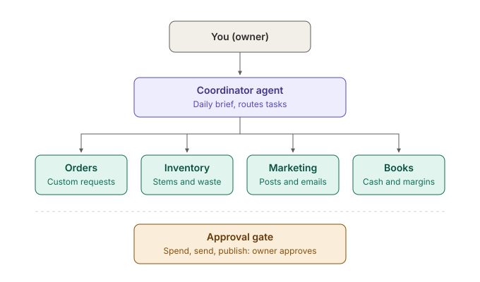

# Flower Shop Agents

A small, readable reference implementation of **worker-agent orchestration** for a small business, from [Wildflower Software](https://wildflowersoftware.com).

One coordinator agent talks to the owner. It delegates to four narrow worker agents. The workers get their tools from an MCP server built with [FastMCP](https://gofastmcp.com). Anything that spends money, commits to a customer or goes public passes through an approval gate before it happens.



The flower shop is a teaching example. The same pattern runs a clinic front desk, a property manager's inbox or an enterprise operations team; the workers and tools change, the shape does not.

## What's inside

| Path | What it does |
| --- | --- |
| `shop_agents/workers.py` | The four workers: a job description and an allow-list of tools each |
| `shop_agents/tools.py` | The shop's tools as a FastMCP server |
| `shop_agents/approval.py` | The approval gate, the list of tools that run without approval, and the audit trail |
| `shop_agents/runner.py` | The tool-use loop for one worker, calling tools through an MCP client |
| `shop_agents/coordinator.py` | The coordinator, whose only tools are the workers |
| `main.py` | Command-line entry point with interactive approvals |
| `tests/` | Offline tests using a scripted fake client, no API key needed |

## Run it

```bash
uv venv
uv pip install -r requirements.txt
export ANTHROPIC_API_KEY=your-key-here

uv run python main.py                                  # the morning brief
uv run python main.py "Quote the June wedding inquiry"  # any request
```

After the coordinator answers, you'll be asked to approve or reject each queued action. Every decision is appended to `audit.jsonl`.

Set `SHOP_AGENTS_MODEL` to choose a different Claude model.

### The tools are an MCP server

By default the shop's MCP server runs inside `main.py`, connected in memory. It is also a standalone server that any MCP client can use:

```bash
uv run python -m shop_agents.tools    # serves the tools over stdio
```

To point the agents at a different server, set `SHOP_AGENTS_MCP` to its URL or script path. The approval gate and the workers' allow-lists still apply, whatever the server offers.

## Test it

```bash
uv run pytest
```

The tests run the real MCP server in memory with a scripted fake model. They check the guarantees that matter: read-only tools run immediately, risky tools are queued and never executed without approval, a rejected action never runs, a worker cannot call a tool outside its job, and a server cannot mark its own tool as safe.

## Developer path

- Python is managed by `uv`, pinned in `.python-version`; don't use the system `python3` or Homebrew Python.
- One virtual environment per project, `.venv`, created with `uv venv`.
- Install packages with `uv pip install -r requirements.txt` (uv environments have no `pip`, so "No module named pip" is expected) and pin them in `requirements.txt`.
- Run commands with `uv run ...` or after `source .venv/bin/activate`.

## Design choices

- **Narrow workers.** Each worker gets a short job description and only the tools that job needs. Narrow agents are easier to test, cheaper to run and easier to trust.
- **The coordinator has no direct access.** Its only tools are the workers, so every real action flows through a worker's allow-list and the gate.
- **Approval is enforced in code, not in the prompt.** The model is told about approvals, but the gate is what actually stops an action.
- **The server describes tools; the orchestrator decides what's safe.** MCP tools carry hints like `readOnlyHint`, but the MCP spec says clients should treat them as untrusted. The list of tools that run without approval lives in `approval.py`, and any tool not on it waits for the owner.
- **Honest tool results.** A queued action returns "NOT carried out", so the agent reports it as waiting rather than done.
- **Audit by default.** Every automatic run, queue, approval and rejection is logged.

## Taking it to production

The demo shop lives in memory. In a real deployment you would replace the tool functions in the MCP server with your POS, email, calendar and supplier integrations, or point the agents at MCP servers those systems already provide, move the approval queue to somewhere the owner already works (Slack, email, a phone notification), and run the morning brief on a schedule.

For larger organizations, the same structure extends with per-role permissions, persistent audit storage, evaluation suites for each worker and deployment inside your own cloud.

Need help adapting this to your business? [Get in touch with Wildflower Software](https://wildflowersoftware.com).

## License

MIT
